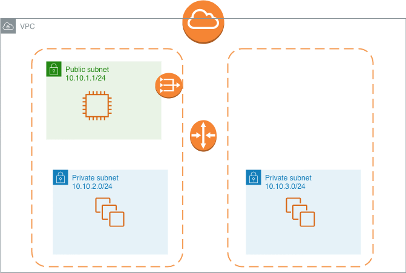

# flask-python-hello-world

A test project that finally gave me the chance to go thorugh terraform. It uses terraform to get the neccesary components up and running
and then, with ansible it provisions the host. GitHub actions was tested for the first time  and ansible is used to deploy to the respective envs. 

## Full deployment

1. Get [terraform](https://www.terraform.io/downloads.html)
2. Make sure you create a "default" profile with the appropriate tokens for aws.
3. Generate ssh-keys and store them in ```iac/.keys/```
4. ```cd iac/terraform && terraform init && terraform apply``` 
5. To provison the hosts, you need to have ansible installed. ```python -m venv venv && source venv/bin/activate && && pip install ansible```
6. Add ```hosts.ini``` with the respecitve addresses to the machines.
6. Edit the playbook to point to the correct ssh key pair, once done run ```ansible-playbook -i hosts.ini provision_docker_hosts.yml```

## Development installation

Use the package manager [pip](https://pip.pypa.io/en/stable/) to install requirments such as flask-api.

```bash
python -m venv venv && pip install -r requirments.txt
```

## What is attempts to build

It creates 3 subnets; 2 of them private with cidr ```10.10.2.0/24``` and ```10.10.3.0/24```and a public subnet ```10.10.1.0/24``` 2 base docker hosts are created and a bastion for access. The machines will host dev_ and master_ container and they will be load balanced by an elb. 





## What doesn't work
* The github actions for ansible is not working; its complaing about the new format for modules
* ELB needs to be added to added and ```main.tf``` needs some clean up; not dry.

## Contributing
Pull requests are welcome. For major changes, please open an issue first to discuss what you would like to change.

Please make sure to update tests as appropriate.

## License
[MIT](https://choosealicense.com/licenses/mit/)